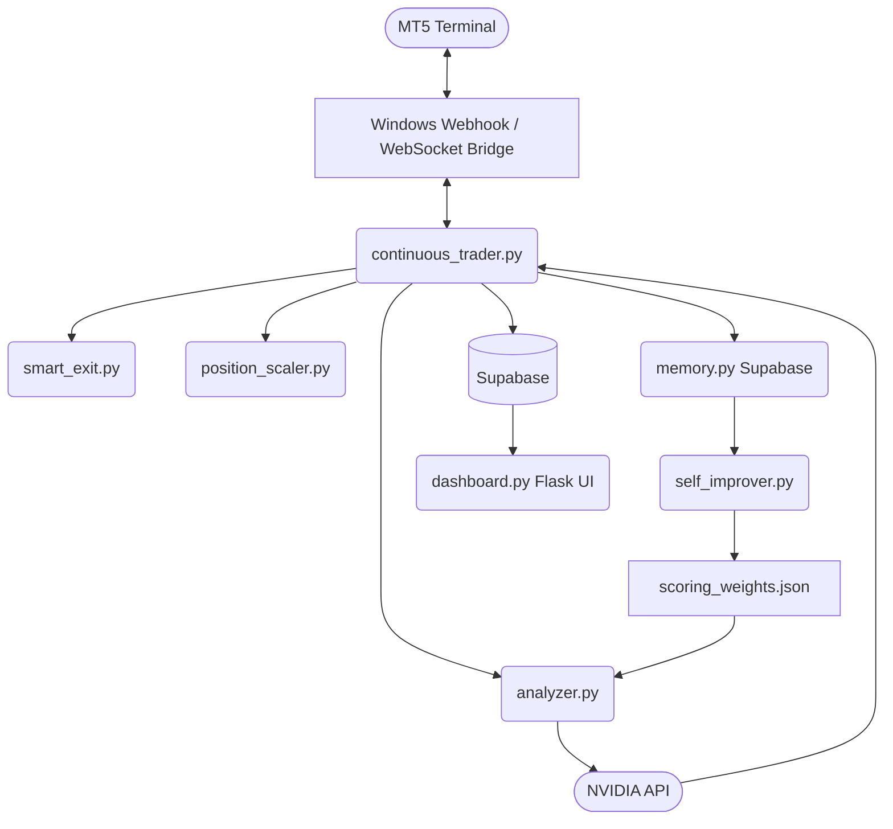

# System Architecture

MetatradeXM is a hybrid deterministic/AI automated trading system.

## High-Level Data Flow

## Core Components

### 1. `continuous_trader.py` (The Engine)
The core asynchronous loop running 24/7. It reads from the Windows webhook/WebSocket bridge, routes market ticks and candles to the analyzer, and executes actual trades based on the analyzer's output.

### 2. `webhook_bridge.py` / `ws_bridge.py` (The Connectors)
These bridge classes convert generic bot commands (`place_order`, `get_tick`) into the HTTP and WebSocket calls handled by the Windows MT5 bridge.

### 3. `analyzer.py` & `ai_client.py` (The Brains)
- **`analyzer.py`**: Fetches M15, H1, H4, and D1 candles. Computes 12 technical factors (H4+D1 trend, RSI, MACD, ADX, Bollinger Bands, Stochastic, etc.) using `pandas_ta`. Scores factors with weights from `scoring_weights.json` (threshold: ±6 for H4/D1 alignment).
- **`ai_client.py`**: Packages the raw indicator data into a prompt and asks NVIDIA API (or fallback Ollama) for trade confirmation. Returns a final confidence score (70%+ is profitable; <70% filtered out).

### 4. `smart_exit.py` & `position_scaler.py` (The Managers)
- **`smart_exit.py`**: 4-rule exit hierarchy: (1) catastrophic backstop ($200 USD loss), (2) time-based close (72h max age, 24h stale check), (3) profit-lock (arm at 2R, protect 1R), (4) trailing stop (ADX-adaptive, activates at 1.5R). All R-based thresholds dynamically scale to each position's actual SL distance.
- **`position_scaler.py`**: If a trade is successfully in profit and the current analysis says the trend is continuing, it enters a secondary, smaller position (pyramiding — currently disabled).

### 5. `self_improver.py` & `memory.py` (The Adaptors)
- **`memory.py`**: Logs every closed trade (with JSON contexts of indicators, confidence, timeframe) into Supabase. Tracks per-factor effectiveness (win rate, avg pips when winning/losing).
- **`self_improver.py`**: Runs daily (only if 20+ trades in last 24h). Analyzes factor effectiveness, detects session/direction biases, adjusts `scoring_weights.json` (±3% per factor, floor 0.85–ceil 1.20). Backup created before each write; roll back by copying any `scoring_weights.backup.*.json` file over the live one.

### 6. `dashboard.py` (The Interface)
A lightweight Flask server serving a single responsive HTML page backed by Supabase live tables and recent runtime events.
